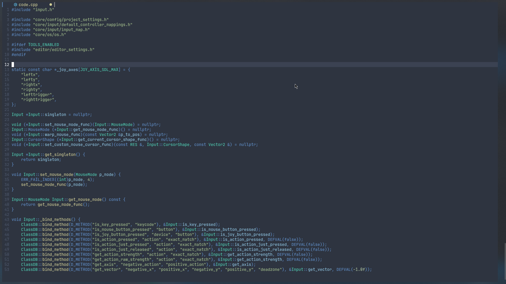

(WIP)A Lush Theme inspired by Nord and Onedark for Neovim with SUPER emphasis on blueness.
===
See: http://git.io/lush.nvim for more information on Lush and a helper script
to setup your repo clone.

## Please keep in mind some of the colors will look differently on your config due to the fact that I made my own custom queries
