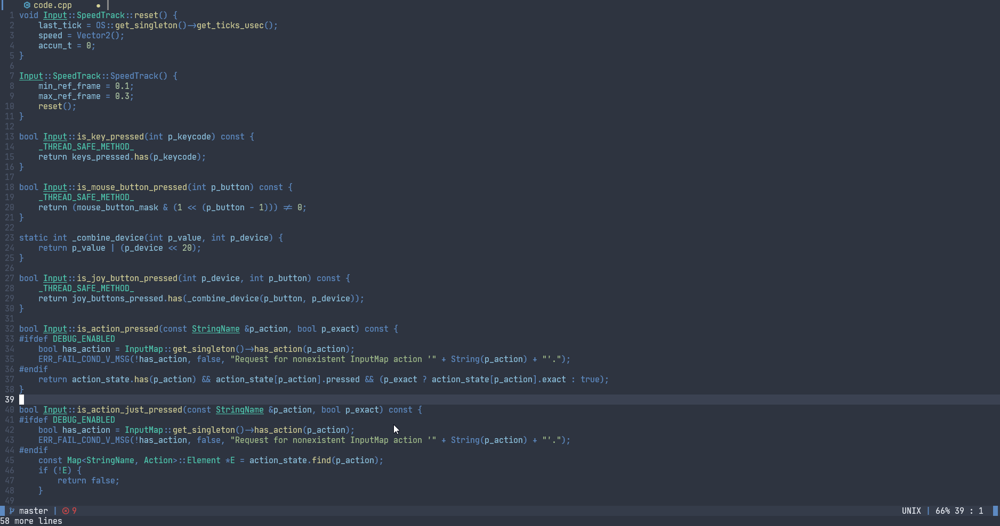

Papadark
===
# Moving To [themer.lua](https://github.com/NarutoXY/themer.lua)
A [nord](https://www.nordtheme.com/) and dark+ inspired colorscheme using [lush.nvim](https://github.com/rktjmp/lush.nvim)(still wip)



### Supports
- Treesitter
- LSP
- [Telescope](https://github.com/nvim-telescope/telescope.nvim/)
- [nvim-tree](https://github.com/kyazdani42/nvim-tree.lua)
- [gitsigns](https://github.com/lewis6991/gitsigns.nvim)
- [lsp-trouble](https://github.com/folke/lsp-trouble.nvim)

### Requirements
- Neovim 0.5 or greater(I might make vim compatible once I get to it)
- [lush.nvim](https://github.com/rktjmp/lush.nvim) installed

### Installation
With `packer.nvim`
```lua
use {'MordechaiHadad/nvim-papadark', requires = {'rktjmp/lush.nvim'}}
```

With `Vim-Plug`
```vim
Plug 'rktjmp/lush.nvim'
Plug 'MordechaiHadad/nvim-papadark'
```

### Configure
In your `init.lua` file

```lua
vim.cmd('syntax on')
vim.cmd('set termguicolors')
vim.cmd('colorscheme papadark')
```

or in `init.vim`
```vim
syntax on
set termguicolors
colorscheme papadark
```
